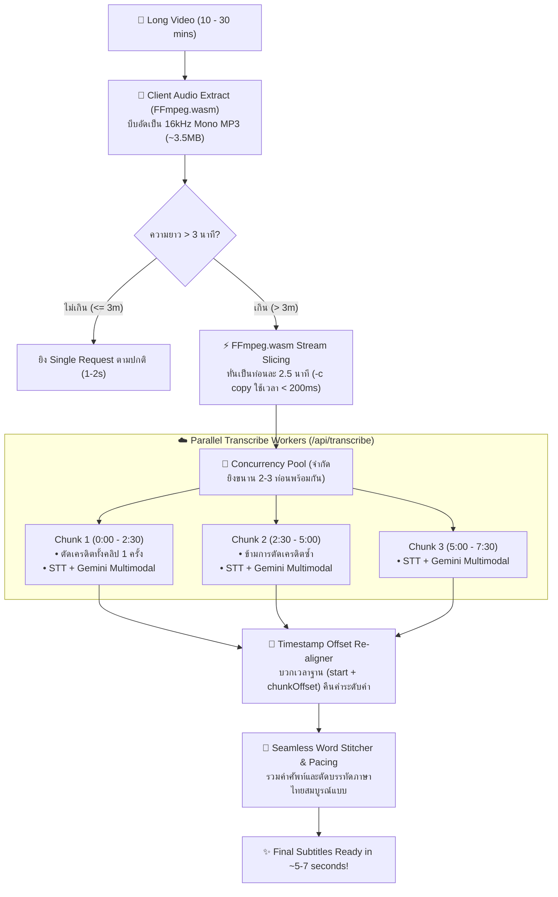

# 🚀 Implementation Plan: Client-Side Smart Audio Chunking & Parallel Transcription Engine

ยกระดับระบบให้รองรับคลิปวิดีโอขนาดยาว **10 – 30+ นาที** ได้อย่างรวดเร็วและไม่มีวัน Timeout บน Vercel ด้วยเทคนิค **Client-Side Stream Chunking & Concurrency-Controlled Parallel Transcription**

---

## 🏗️ Architecture & Data Flow

---

## 🛠️ Proposed Changes

### 1. Client Audio Slicing Utility (`web/src/lib/audio-extract.ts`)
- เพิ่มฟังก์ชัน `sliceAudioIntoChunks(audioBlob: Blob, totalDuration: number, chunkDurationSec = 150)`:
  - ใช้ FFmpeg.wasm `-ss {start} -t {duration} -c copy` ตัดแบ่งท่อนละ 2.5 นาที (150 วินาที)
  - เพราะใช้ Stream Copy (`-c copy`) การหั่น 5-10 ท่อนจึงใช้เวลาไม่ถึง **200 มิลลิวินาที** และไม่เปลือง CPU

---

### 2. Transcribe Concurrency Orchestrator (`web/src/lib/transcribe.ts`)
- ปรับปรุง `transcribeAudio`:
  - ตรวจสอบ `mediaDuration`: ถ้า $> 180$ วินาที จะเข้าสู่โหมด Parallel Chunking
  - รัน Concurrency Pool (จำกัดยิงขนานพร้อมกัน 2-3 Requests) ป้องกัน 429 Too Many Requests
  - ส่งพารามิเตอร์ `chunkIndex`, `totalChunks`, `isChunkPart`, `duration`
  - คำนวณ Re-offsetting สำหรับ Timestamps ทุกคำ: `word.start += chunkOffset`, `word.end += chunkOffset`
  - นำผลลัพธ์ของทุก Chunk มาร้อยเรียงกันเป็น `rawWords` array เดียวกันอย่างแนบเนียน

---

### 3. Server-Side Transcribe Route (`web/src/app/api/transcribe/route.ts`)
- รองรับ Chunked Requests:
  - อ่านค่า `chunkIndex`, `totalChunks`, `isChunkPart`
  - **ความปลอดภัยด้านเครดิต:** ตัดเครดิตเฉพาะ `chunkIndex === 0` เต็มจำนวน และ Chunk อื่นๆ (`isChunkPart === true`) จะข้ามการตัดเครดิตซ้ำ
  - ปลดล็อกความยาวสำหรับ Chunk Part แต่ละท่อน

---

## 🧪 Verification Plan

### Automated Build
- รัน `npm run build` เพื่อตรวจสอบ TypeScript types และ Server routes ทั้งหมด

### Manual Testing Flow
- ทดสอบคลิปสั้น ($\le 3$ นาที) $\rightarrow$ วิ่งเส้นทาง Single Request ปกติ
- ทดสอบคลิปยาว ($> 3$ นาที เช่น 5 นาที, 10 นาที) $\rightarrow$ ตรวจสอบว่าระบบหั่นท่อนและส่งขนาน ผลลัพธ์ซับไตเติลต่อกันสนิทและ Timestamps ตรงตำแหน่ง 100%
