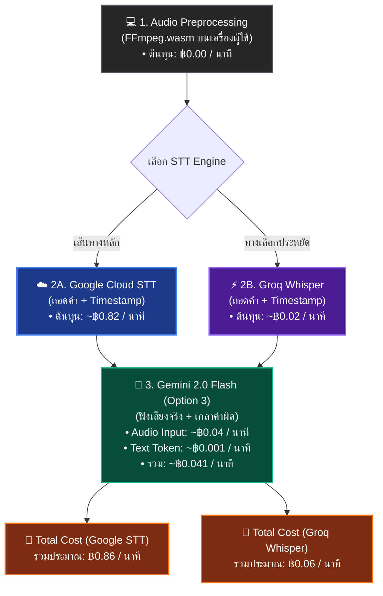

# 📊 โครงสร้างต้นทุนการทำงาน (Cost Structure per Minute)

สรุปต้นทุนการถอดเสียงต่อนาที หลังจากอัปเกรดระบบความแม่นยำครบทั้ง 4 ด่าน (รวม Option 3: Gemini Multimodal แล้ว)

---

## 💰 สรุปต้นทุนแบบเจาะลึก (Per Minute)

ระบบถูกออกแบบให้ **Zero-Cost ในส่วนที่มีโหลดสูง (Audio Processing)** และใช้ต้นทุนเฉพาะส่วน AI Core เท่านั้น:

### 1. 🎵 Client-Side Audio Preprocessing (Option 1)
- **ต้นทุน:** **฿0.00 / นาที**
- **เหตุผล:** เราใช้ FFmpeg.wasm บีบอัดเสียง กรองคลื่นรบกวน (Highpass/Lowpass) บน RAM เบราว์เซอร์ของผู้ใช้ (Client-side) ทำให้ประหยัดค่าเช่า Server Processing ไปได้ 100%

### 2. 🎙️ Speech-to-Text Engine (ตัวถอดความดิบ)
มี 2 ทางเลือกที่ประมวลผลคู่ขนานแบบ Chunking ได้:
- **Google Cloud STT (ความแม่นยำสูงภาษาไทย):** ~$0.024/นาที $\approx$ **฿0.82 / นาที**
- **Groq Whisper (ทางเลือกประหยัด/เร็ว):** ~$0.0005/นาที $\approx$ **฿0.02 / นาที**

### 3. 🧠 AI Auto-Correction (Option 2 + 3)
ใช้ **Gemini 2.0 Flash Multimodal** (ส่งทั้งไฟล์เสียง MP3 และข้อความดิบให้ AI ฟังและตรวจทาน):
- **Audio Input Cost:** โมเดลคิดที่ $0.00002 / วินาที $\rightarrow$ 1 นาที = $0.0012 $\approx$ **฿0.04 / นาที**
- **Text (Prompt + Context):** ต้นทุนถูกมากระดับ Micro-cent $\approx$ **฿0.001 / นาที**
- **ต้นทุน AI รวม:** $\approx$ **฿0.041 / นาที**

---

## 🏁 สรุปต้นทุนรวมสุทธิ (Total System Cost)

| โหมดการทำงาน | STT Cost | Gemini Cost | ต้นทุนรวม (บาท / นาที) | ต้นทุนคลิป 10 นาที |
| :--- | :--- | :--- | :--- | :--- |
| **Google STT Pathway** (เน้นแม่นยำสูงสุด) | ฿0.82 | ฿0.041 | **~฿0.86 / นาที** | **~฿8.60** |
| **Groq Whisper Pathway** (เน้นประหยัด/รวดเร็ว) | ฿0.02 | ฿0.041 | **~฿0.06 / นาที** | **~฿0.60** |

💡 **จุดเด่น:** แม้เราจะเพิ่ม Option 3 ให้ AI ฟังเสียงจริง (Multimodal) ซึ่งทำให้ความแม่นยำก้าวกระโดด แต่ต้นทุนที่เพิ่มขึ้นมานั้น **แค่ 4 สตางค์ต่อนาทีเท่านั้น** ถือว่าคุ้มค่ามหาศาลเมื่อเทียบกับผลลัพธ์ที่ผู้ใช้ไม่ต้องมานั่งแก้คำผิดด้วยตัวเองค่ะ!
