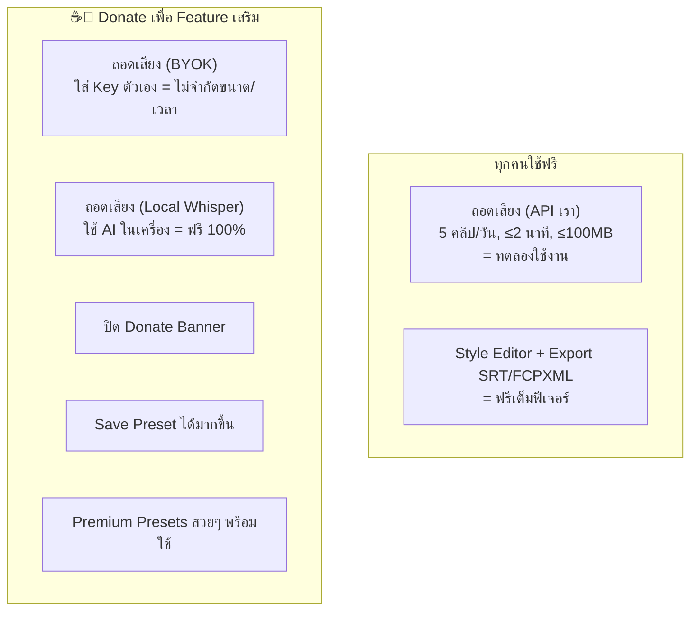
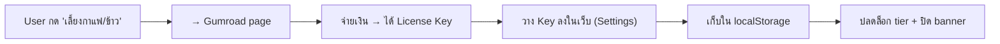
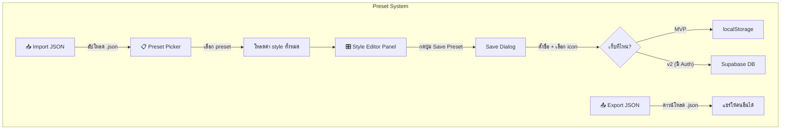
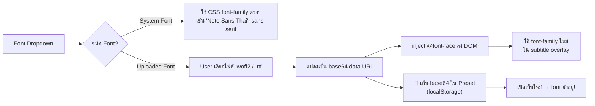

# 📘 Technical Specification Blueprint v4
## Thai Caption Web — ระบบถอดเสียงภาษาไทยอัตโนมัติบนเว็บ

> **Version:** 4.12
> **วันที่:** 25 สิงหาคม 2026
> **จัดทำโดย:** Sunday (AI Assistant) ร่วมกับพี่เอ
> **Status:** 🟡 รอ Review จากพี่เอ
> **Changes from v4:** ปรับเงื่อนไข Tier (Preset limits, 5 clips/day, BYOK & Local Whisper สำหรับ Paid tier เท่านั้น)

---

## สารบัญ

1. [Project Overview & Scope](#1--project-overview--scope)
2. [Freemium Strategy & Competitive Positioning](#2--freemium-strategy--competitive-positioning)
3. [Recommended Tech Stack](#3--recommended-tech-stack)
4. [System Flow & Data Schema](#4--system-flow--data-schema)
5. [Recommended Folder Structure](#5--recommended-folder-structure)
6. [UI/UX Design Specification](#6--uiux-design-specification)
7. [Step-by-Step Implementation Roadmap](#7--step-by-step-implementation-roadmap)
8. [Appendix](#8--appendix)

---

## 1. 🎯 Project Overview & Scope

### 1.1 ปัญหาที่แก้

Content Creator ชาวไทย (YouTuber, TikToker, IG Reels) ที่ต้องทำ Subtitle ให้วิดีโอ ประสบปัญหา:

| ปัญหา | รายละเอียด |
|-------|-----------|
| ⏱️ เสียเวลา | พิมพ์ subtitle มือ ใช้เวลา 3-5 เท่าของความยาววิดีโอ |
| 🇹🇭 ภาษาไทยยาก | AI ทั่วไปถอดไทยไม่แม่น ต้องแก้เยอะ |
| 💰 เครื่องมือแพง | SaaS ต่างประเทศคิดค่าสมาชิกรายเดือนสูง / tamsub ให้ฟรีแค่ 5 คลิป |
| 🖥️ จำกัด Platform | แอปเดิม (Thai Caption Studio) ใช้ได้เฉพาะ macOS |

### 1.2 วิธีแก้

**Thai Caption Web** — เว็บแอปถอดเสียงภาษาไทยอัตโนมัติ ที่:
- ใช้ผ่าน Browser ได้ทุก OS (Mac, Windows, iPad)
- ถอดเสียงด้วย AI (Groq Whisper) **ฟรีไม่จำกัดจำนวนคลิป** (ใส่ Key ตัวเอง)
- มี **Subtitle Style Editor** — ปรับ font, สี, ขนาด, ตำแหน่ง + preview บนวิดีโอ
- **Word Highlight** — ไฮไลท์คำที่กำลังพูดแบบ real-time (เปิด/ปิด + เลือกสี)
- **Burn Subtitle → MP4** — ดาวน์โหลดวิดีโอพร้อม subtitle ฝังเรียบร้อย (ตรงตาม preview 100%)
- Export `.srt` และ `.fcpxml` ไปใช้กับ Final Cut Pro, Premiere, CapCut ฯลฯ
- รองรับ **Local Whisper** — ถอดเสียงด้วย AI ในเครื่องตัวเองได้ (ฟรี 100%)

### 1.3 กลุ่มผู้ใช้งาน

| กลุ่ม | ใช้ทำอะไร | Priority |
|-------|----------|----------|
| 🎯 **พี่เอ (Primary)** | ถอดเสียงวิดีโอ Content ของตัวเอง | สูงสุด |
| 🎬 Content Creator ไทย | ทำ subtitle สำหรับ TikTok/Reels/Shorts | ระยะถัดไป |
| 🎙️ Podcaster | ถอดเสียง podcast เป็น text | ระยะถัดไป |

### 1.4 ฟีเจอร์ MVP (Must Have)

| # | ฟีเจอร์ | รายละเอียด |
|---|---------|-----------|
| F1 | **Upload ไฟล์** | ลาก/วางหรือเลือกไฟล์ video/audio (mp4, mov, m4a, wav, mp3) - Free จำกัด 100MB, Paid/BYOK ไม่จำกัด |
| F2 | **เลือก AI Provider** | Dropdown: Groq Whisper (default) / ElevenLabs / Local Whisper |
| F3 | **ถอดเสียงอัตโนมัติ** | กดปุ่ม → ส่งไฟล์ไป AI → ได้ segments กลับมา (Free: 5 คลิป/วัน, ≤2 นาที/คลิป, system quota 200 คลิป/วัน) |
| F4 | **Progress indicator** | แสดงสถานะ: กำลังอัปโหลด / กำลังถอดเสียง / เสร็จแล้ว |
| F5 | **Caption Editor Table** | ตารางแก้ไข: ลำดับ, เวลาเริ่ม, เวลาจบ, ข้อความ |
| F6 | **Video Preview + Subtitle Overlay** | เล่นวิดีโอพร้อมแสดง subtitle ตาม style ที่เลือก |
| F7 | **Export .srt** | กดปุ่ม → ดาวน์โหลดไฟล์ .srt |
| F8 | **Responsive UI** | ใช้งานได้ดีทั้ง Desktop และ Tablet |
| F10 | **Subtitle Style Editor** | ปรับ font, สีตัวอักษร, ขนาด, ตำแหน่ง, เงา, outline + preview สด |
| F11 | **Export FCPXML / XML** | ดาวน์โหลด `.fcpxml` (สำหรับ FCP) หรือ `.xml` ปกติ (สำหรับ Premiere/DaVinci พร้อมคำเตือนเรื่อง Style) |
| F16 | **Local Whisper Mode** | ถอดเสียงด้วย mlx_whisper ในเครื่อง (เมื่อรัน localhost) ไม่จำกัดเวลา/จำนวน (**เฉพาะ Paid Tier**) |
| F18 | **Preset System** | บันทึก/โหลด preset ได้ (Free: 1 ชุด, ☕: 10 ชุด, 🍚: 30 ชุด) รวม font + สี + ขนาด + ตำแหน่ง + max chars + resolution + FPS |
| F19 | **BYOK (Bring Your Own Key)** | User ใส่ API Key ตัวเอง → ถอดเสียงไม่จำกัดจำนวน/เวลา/ขนาดไฟล์ (**เฉพาะ Paid Tier**) |
| F20 | **Donate Banner + Tier Gate** | แสดง banner "เลี้ยงกาแฟ/ข้าวพี่เอ" สำหรับ Free tier + ระบบ License Key ปลดล็อก preset/premium features |
| F21 | **🆕 Burn Subtitle → MP4** | ใช้ ffmpeg.wasm render วิดีโอ + subtitle บน browser → ดาวน์โหลด MP4 ที่มี subtitle ฝังเรียบร้อย (WYSIWYG 100%, ค่าใช้จ่าย ฿0) |
| F22 | **🆕 Word Highlight** | Highlight คำที่กำลังพูดแบบ real-time (เปิด/ปิดได้ + เลือกสี) — ใช้ word-level timestamps จาก Groq, preview สด + export ใน FCPXML/MP4 |
| F23 | **🆕 Admin Dictionary Sync** | ตรวจจับการแก้คำผิดของแอดมิน ➔ แสดงปุ่ม 1-Click บันทึกคู่คำขึ้น Supabase ช่วย AI แม่นยำขึ้น |

### 1.5 ฟีเจอร์ v2 (Nice-to-Have — ทำทีหลัง)

| # | ฟีเจอร์ | หมายเหตุ |
|---|---------|---------|
| F9 | Waveform Timeline (wavesurfer.js) | เห็นคลื่นเสียง + ลาก subtitle block |
| F12 | Google OAuth Login (Supabase) | บันทึก project, history, **Cloud Sync** (Custom Fonts/Presets/Dictionary สำหรับ Tier 299฿) และระบบ Upgrade Tier จ่ายส่วนต่าง |
| F13 | Dashboard — Project List | เปิดดู/แก้ไข project เก่า |
| F14 | Import .srt | โหลด .srt เข้ามาแก้ไขได้ |
| F15 | Batch processing | ถอดเสียงหลายไฟล์พร้อมกัน |
| F17 | Payment Integration | Gumroad / LemonSqueezy สำหรับ one-time payment |

### 1.6 สิ่งที่ไม่ทำใน MVP

- ❌ ไม่มี login/register (เปิดใช้ได้เลย, preset เก็บ localStorage)
- ❌ ไม่มี payment integration จริง (แต่มี UI แสดง tier + link ไปซื้อ Gumroad)
- ❌ ไม่ทำ mobile app
- ❌ ไม่มี waveform timeline (ทำ v2)
- ❌ ไม่มี batch processing (ทำ v2)

---

## 2. 💎 Monetization & Competitive Strategy

### 2.1 Business Model — Community Tool + Donation

> **ปรัชญา:** เราสร้างเครื่องมือ**ฟรีให้ content creator ไทย** ใช้งานได้จริง
> รายได้มาจาก**การ donate** (เลี้ยงกาแฟ/ข้าว) เพื่อปลดล็อก feature เสริม
> **ไม่ใช่ paywall** ที่บังคับจ่าย — ทุกคนถอดเสียงได้ฟรีตลอด



### 2.2 Tier Comparison

| ฟีเจอร์ | 🆓 ใช้ฟรี | ☕ เลี้ยงกาแฟ ฿99 | 🍚 เลี้ยงข้าว ฿299 |
|---------|----------|-------------------|---------------------|
| **ถอดเสียง (API เรา)** | 5 คลิป/วัน, ≤2 นาที | 5 คลิป/วัน, ≤2 นาที | 5 คลิป/วัน, ≤2 นาที |
| **ขนาดไฟล์วิดีโอสูงสุด** | 100 MB | ✅ **ไม่จำกัด (Client-side Extraction)** | ✅ **ไม่จำกัด (Client-side Extraction)** |
| **ถอดเสียง (BYOK — Key ตัวเอง)** | ❌ 🔒 | ✅ ไม่จำกัดความยาว/ขนาด | ✅ ไม่จำกัดความยาว/ขนาด |
| **ถอดเสียง (Local Whisper)** | ❌ 🔒 | ✅ ไม่จำกัดความยาว/ขนาด | ✅ ไม่จำกัดความยาว/ขนาด |
| **Style Editor** | ✅ เต็มฟีเจอร์ | ✅ | ✅ |
| **Export SRT** | ✅ | ✅ | ✅ |
| **Export FCPXML / XML** | ✅ | ✅ | ✅ |
| **🔥 Burn Subtitle → MP4** | ✅ | ✅ | ✅ |
| **Word Highlight** | ✅ | ✅ | ✅ |
| **Donate Banner** | แสดง "เลี้ยงกาแฟ/ข้าวพี่เอ" | ✅ **ปิด** | ✅ **ปิด** |
| **Custom Presets** (ที่ Save ได้) | 1 ชุด | 10 ชุด | **30 ชุด** |
| **Premium Presets** (สำเร็จรูป) | ✅ 1 ชุด | ✅ 3 ชุด | ✅ **10 ชุด** |
| **ราคา** | ฟรีตลอด | จ่ายครั้งเดียว ฿99 | จ่ายครั้งเดียว ฿299 |

> [!NOTE]
> **API ของเรา = แค่ให้ทดลอง** ชอบแล้วไปเอา Key ตัวเองมาใช้ ฟรีเหมือนกัน
> เราเน้น donate เพื่อ feature เสริม (preset, font สวยๆ, ปิด banner) ไม่ได้บังคับจ่าย

> [!TIP]
> **🔮 Roadmap Requirement: Premium Preset Showcase / Live Preview Modal**
> เพื่อช่วยให้ Creator เห็นความคุ้มค่าและช่วยในการตัดสินใจสนับสนุน Tier 299฿ (เลี้ยงข้าว) ในอนาคตจะมีหน้าหรือ Modal ตัวอย่าง **"Preset Showcase Gallery"** เพื่อแสดงภาพตัวอย่างซับไตเติลสวยๆ ทั้ง 10 แบบที่ใช้ฟอนต์พรีเมียมลิขสิทธิ์แท้ (Visual Preview) ให้เห็นความสวยงามก่อนสนับสนุน (วางแผนทำในเฟสถัดไป)

### 2.3 System Daily Quota — ป้องกันค่า API ระเบิด

| ตัวแปร | ค่า | เหตุผล |
|--------|-----|--------|
| **System Quota** | **200 คลิป/วัน** (รวมทุก user) | อยู่ใน Groq Free Tier (200 × 2 นาที = 400 นาที < 480 นาที limit) |
| **Per-User Limit** | 5 คลิป/วัน | ป้องกัน user คนเดียวกิน quota หมด |
| **Clip Duration** | ≤2 นาที (ใช้ API เรา) | คุม cost + เหมาะกับ TikTok/Reels/Shorts |
| **BYOK / Local** | ไม่จำกัด (เฉพาะ Paid) | ไม่กิน system quota |

**เมื่อ quota เต็ม:**
```text
┌────────────────────────────────────────────────────────────────────────┐
│ ⏰ Server Busy คลิปที่สร้าง SUBTitle ทั้งระบบเกินจำนวนโควต้าต่อวัน                 │
│    ให้ลองสร้างสรรค์ใหม่ในวันพรุ่งนี้                                             │
│                                                                        │
│ ✨ (สำหรับ ☕/🍚) ใส่ API Key ตัวเอง ใช้ได้ไม่จำกัดเลย!                        │
│ 💻 (สำหรับ ☕/🍚) ใช้ Local Whisper ถอดเสียงบนเครื่องตัวเอง                    │
└────────────────────────────────────────────────────────────────────────┘
```

### 2.4 API Cost — ค่าใช้จ่ายจริง

| ตัวแปร | คำนวณ | ผลลัพธ์ |
|--------|-------|---------|
| ค่า Groq Turbo | \$0.04 / ชั่วโมงเสียง | - |
| ต่อคลิป (2 นาที) | \$0.04 ÷ 60 × 2 | **฿0.048 / คลิป** |
| System quota 200 คลิป/วัน | 200 × 2 นาที = 400 นาที | < Groq Free 480 นาที |
| **ค่าใช้จ่ายต่อเดือน** | - | **฿0 (อยู่ใน Free Tier!)** |

> [!IMPORTANT]
> **ต้นทุน API = ฿0 ต่อเดือน** ตราบใดที่ system quota ≤ 240 คลิป/วัน (480 นาที ÷ 2 นาที)
> ถ้าอนาคตอยากเพิ่ม quota → Groq Paid ราคาแค่ \$0.04/ชม. ถูกมาก

### 2.5 Font + Export Workflow — ข้อควรรู้

| Export | Font สวยตาม Preset ไหม | Word Highlight | หมายเหตุ |
|--------|----------------------|---------------|---------|
| **🔥 Burn MP4** | ✅ **ได้เป๊ะ 100%!** ตรงตาม preview | ✅ ได้ | ffmpeg.wasm render บน browser → ค่าใช้จ่าย ฿0 |
| **.fcpxml** | ✅ ได้ครบ font, สี, เงา, ตำแหน่ง | ✅ ได้ | ต้องมี font ในเครื่อง + ใช้ได้เฉพาะ FCP |
| **.xml (Premiere/DaVinci)** | ⚠️ อาจจะไม่ตรง | ❌ ไม่ได้ | แสดง tip: "Style อาจเพี้ยนและไม่มี Highlight" |
| **.srt** | ❌ ไม่ได้ (เก็บแค่ text + เวลา) | ❌ ไม่ได้ | แสดง tip: "อยากได้สไตล์สวย? ใช้ Burn MP4" |

**วิธีแก้ให้ Preset มีค่ากับทุก format:**
- **Burn MP4** = ทางออกหลัก! ตรงตาม preview 100% ลง TikTok/Reels/YouTube ได้เลย
- Preset ใช้เฉพาะ **Google Fonts ฟรี** (Kanit, Sarabun, Prompt ฯลฯ) → ทุกคนโหลดได้
- ตอน export FCPXML → แสดง **"Preset นี้ใช้ font Kanit Bold → [ดาวน์โหลดฟรี]"**
- ตอน export SRT → แสดง **"Tip: ใช้ Burn MP4 เพื่อได้ style ตรงตาม preview"**

### 2.6 เทียบกับ tamsub.com

| จุดเปรียบเทียบ | tamsub.com | Thai Caption Web (เรา) |
|---------------|-----------|----------------------|
| **Free Tier** | ฟรี 5 คลิป → จบ ต้อง subscription | ✅ ฟรี 5 คลิป/**ทุกวัน** (Paid = BYOK ไม่จำกัด) |
| **ราคา** | Subscription รายเดือน | ✅ Donate ครั้งเดียว ฿99/฿299 |
| **VDO ยาวสุด** | Pack แพงสุด = 10 นาที | ✅ BYOK = **ไม่จำกัดความยาว** |
| **Burn Subtitle → MP4** | ✅ (server render) | ✅ **(browser render = ฟรี!)** |
| **Word Highlight** | ❌ | ✅ **ไฮไลท์คำ real-time** |
| **FCPXML** | ❌ | ✅ พร้อม font style |
| **Local AI** | ❌ | ✅ ฟรี 100% |
| **Preset System** | ❌ | ✅ Save/Load/Export/Import |
| **BYOK** | ❌ | ✅ ใส่ Key ตัวเอง ใช้ไม่อั้น |

### 2.7 License Key Flow (MVP)



### 2.8 Google OAuth & Pro-rated Upgrade Strategy (Post-MVP)

ในระยะถัดไป (v2) ระบบจะรองรับ **Google OAuth Login** ผ่าน Supabase เพื่อแก้ปัญหา localStorage หายและเพิ่มความสามารถใหม่:

1. **Cloud Sync (สำหรับ Tier 299฿ เท่านั้น):**
   - ผู้ใช้สามารถล็อกอินเพื่อ Sync **Custom Fonts**, **Custom Presets** และ **Dictionary** (คู่คำผิดที่แก้บ่อย) ขึ้น Cloud ได้ 
   - เปลี่ยนเครื่องใช้งาน ก็ดึงข้อมูลเดิมกลับมาได้ทันที
2. **Pro-rated Upgrade (จ่ายเฉพาะส่วนต่าง):**
   - ผู้ใช้ที่เคยสนับสนุน **Tier 99฿ (เลี้ยงกาแฟ)** สามารถล็อกอินเข้าระบบ
   - หากต้องการอัปเกรดเป็น **Tier 299฿ (เลี้ยงข้าว)** ระบบจะคำนวณราคาให้ใหม่ โดยหักลบกับ 99฿ เดิม
   - ผู้ใช้จ่ายเพียงแค่ **200฿** สำหรับการอัปเกรดเพื่อเข้าถึง Cloud Sync และจำนวน Preset ที่มากขึ้น

---

## 3. 🛠️ Recommended Tech Stack

### 3.1 ภาพรวม

```mermaid
graph TB
    subgraph "🌐 Frontend — Browser"
        A["Next.js 15 (App Router)"]
        B["Tailwind CSS + shadcn/ui"]
        C["Zustand (State)"]
        D["HTML5 Video + Subtitle Overlay"]
        W["ffmpeg.wasm (Audio Extraction & Burn MP4)"]
    end

    subgraph "⚙️ Backend — Vercel Serverless"
        E["API: /api/transcribe"]
    end

    subgraph "☁️ External Services"
        G["Groq API (Whisper)"]
    end

    subgraph "💻 Local Mode (Optional)"
        I["FastAPI Server (localhost:8765)"]
        J["mlx_whisper (Apple Silicon)"]
    end

    A -->|1. วิดีโออยู่ที่ Browser| W
    W -->|2. สกัดเสียง (10-15MB)| E
    E -->|3. ส่งเสียงไปถอด| G
    A -.->|"Local Mode"| I
    I --> J
```

### 3.2 รายละเอียดและเหตุผล

| Layer | เทคโนโลยี | ทำไมถึงเลือก |
|-------|-----------|-------------|
| **Framework** | **Next.js 15 (App Router)** | Vercel deploy ทันที, API Routes ในตัว, SSR + CSR |
| **Language** | **TypeScript** | จับ bug ตอนเขียน, autocomplete ดี |
| **Styling** | **Tailwind CSS** | เขียนเร็ว, responsive ง่าย, dark theme built-in |
| **UI Components** | **shadcn/ui** | Component สวย, copy-paste + ปรับแต่งได้อิสระ |
| **State** | **Zustand** | เบา (2KB), ง่ายกว่า Redux มาก |
| **AI (Cloud)** | **Groq Whisper Large V3 Turbo** | ฟรี 8 ชม./วัน, เร็วมาก, ราคาถูก |
| **AI (Local)** | **mlx_whisper + FastAPI** | ฟรี 100%, ใช้ Apple Silicon GPU, มี venv พร้อมแล้ว |
| **Browser Engine** | **@ffmpeg/ffmpeg (ffmpeg.wasm)** | ใช้ **สกัดเสียง (Audio Extraction)** เพื่อลดขนาดไฟล์จาก 1GB เหลือ 10MB ก่อนอัปโหลด และใช้ **Burn Subtitle** |
| **Font Loading** | **CSS @font-face + Font Loading API** | รองรับ system fonts + user upload custom font |
| **FCPXML** | **Port จาก Python engine** | Logic ครบแล้วใน `transcribe_to_fcpxml.py` |
| **Deploy** | **Vercel** | Push GitHub → auto deploy |

---

## 4. 🔄 System Flow & Data Schema

### 4.1 User Flow (MVP) - Client-side Audio Extraction

```mermaid
sequenceDiagram
    actor User as 👤 ผู้ใช้ (Browser)
    participant Web as 🌐 Next.js (Client)
    participant API as ⚙️ Next.js (API)
    participant AI as 🤖 Groq / Local

    User->>Web: 1. ลากไฟล์วิดีโอมาวาง (สมมติ 1GB)
    Web->>Web: 2. ffmpeg.wasm สกัดเฉพาะเสียง → ได้ MP3 ~15MB (Cost ฿0)
    User->>Web: 3. เลือก Provider → กด "ถอดเสียง"
    Web->>API: 4. ส่งไฟล์ MP3 (15MB) ไปที่ API
    API->>AI: 5. ส่งเสียง → AI ถอดเสียง
    AI-->>API: 6. ส่ง segments + word timestamps JSON กลับ
    API-->>Web: 7. ส่ง JSON กลับมาที่ Client
    Web->>Web: 8. cleanText() → wordsToCaptions() → splitLongCaptions()
    Web-->>User: 9. แสดง Editor Page + Word Highlight preview
    User->>Web: 10. แก้ไข text + timing ในตาราง
    User->>Web: 11. ปรับ Style + Word Highlight (เปิด/ปิด + สี)
    User->>Web: 12. Preview subtitle + highlight บนวิดีโอ
    User->>Web: 13. Export → เลือก SRT / XML / FCPXML / 🔥 Burn MP4
    Web-->>User: 14. ดาวน์โหลดไฟล์

### 4.2 API Endpoints

| Method | Path | หน้าที่ | Input | Output |
|--------|------|---------|-------|--------|
| `POST` | `/api/upload` | อัปโหลดไฟล์ | `FormData (file)` | `{ url, filename }` |
| `POST` | `/api/transcribe` | ถอดเสียง (Cloud) | `{ audioUrl, provider, language }` | `{ segments[], words[] }` |
| `POST` | `localhost:8765/transcribe` | ถอดเสียง (Local) | `FormData (file)` | `{ segments[], words[] }` |

### 4.3 Data Structures (TypeScript Types)

```typescript
// ===== Caption แต่ละบรรทัด =====
interface Caption {
  id: string
  index: number
  startMs: number        // เวลาเริ่ม (ms)
  endMs: number          // เวลาจบ (ms)
  text: string
  confidence?: number    // 0-1
  words?: WordToken[]    // 🆕 word-level timestamps สำหรับ highlight
}

// ===== 🆕 Word Token (สำหรับ Word Highlight) =====
interface WordToken {
  word: string
  startMs: number
  endMs: number
  confidence?: number
}

// ===== Subtitle Style =====
interface SubtitleStyle {
  fontFamily: string     // "Noto Sans Thai", "Kanit", etc.
  fontSize: number       // px
  fontWeight: string     // "normal" | "bold"
  fontColor: string      // hex "#FFFFFF"
  backgroundColor: string // hex with alpha "#00000080"
  positionX: number      // % จากกลาง (-50 ถึง 50)
  positionY: number      // % จากล่าง (0 = ล่างสุด)
  shadow: {
    enabled: boolean
    color: string        // hex "#000000"
    offsetX: number
    offsetY: number
    blur: number
    opacity: number      // 0-100
  }
  outline: {
    enabled: boolean
    color: string
    width: number
  }
  wordHighlight: {              // 🆕 Word Highlight settings
    enabled: boolean
    color: string              // hex "#FF6B00" (สีที่ highlight คำ)
  }
  maxCharsPerLine: number // default: 22
}

// ===== Custom Font =====
interface CustomFont {
  id: string
  name: string           // ชื่อที่แสดงใน dropdown
  fontFamily: string     // CSS font-family name
  url: string            // URL ของไฟล์ font (.woff2/.ttf)
  source: "system" | "uploaded"
}

// ===== Project =====
interface Project {
  id: string
  filename: string
  fileUrl: string
  provider: Provider
  language: string
  captions: Caption[]
  style: SubtitleStyle
  status: ProjectStatus
  createdAt: number
}

// ===== Provider =====
type Provider = "groq" | "elevenlabs" | "local"

// ===== Status =====
type ProjectStatus =
  | "idle" | "uploading" | "transcribing"
  | "editing" | "completed" | "error"

// ===== FCPXML Export Config =====
interface FcpxmlConfig {
  width: number          // 1080
  height: number         // 1920
  fps: string            // "30", "23.98", "50" etc.
}

// ===== 🆕 Style Preset =====
interface StylePreset {
  id: string
  name: string           // "TikTok Vertical", "YouTube Landscape" etc.
  icon: string           // emoji เช่น "📱", "🖥️", "🎬"
  style: SubtitleStyle   // ค่า style ทั้งหมด
  fcpxml: FcpxmlConfig   // resolution + FPS
  captionGrouping: {
    maxCharsPerLine: number   // default: 22
    maxDurationSec: number    // default: 2.6
    minDurationSec: number    // default: 0.65
    gapExtendSec: number      // default: 0.08
  }
  customFonts: CustomFont[]   // font ที่ upload มา (เก็บเป็น base64)
  provider: Provider          // AI provider ที่ชอบใช้
  createdAt: number
  updatedAt: number
}

// ===== Preset Storage Config =====
const PRESET_LIMITS = {
  free: 1,               // 🆓 Free tier: Save ได้ 1 preset
  coffee: 10,            // ☕ เลี้ยงกาแฟ: Save ได้ 10 presets
  meal: 30,              // 🍚 เลี้ยงข้าว: Save ได้ 30 presets
}

// ===== Tier / License =====
type UserTier = "free" | "coffee" | "meal"

interface UserLicense {
  tier: UserTier
  licenseKey?: string    // จาก Gumroad (ถ้าซื้อแล้ว)
  groqApiKey?: string    // BYOK: user's own Groq key (เฉพาะ Paid Tier)
  dailyClipCount: number // นับจำนวนคลิปวันนี้ (reset ทุกวัน)
  lastResetDate: string  // วันที่ reset ล่าสุด "2026-08-25"
}

// ===== Usage Limits =====
const USAGE_LIMITS = {
  maxClipsPerDay: 5,          // จำกัดจำนวนคลิป/วัน/user (ใช้ API ของเรา)
  maxClipDurationMin: 2,      // จำกัดความยาว/คลิป (นาที) — BYOK ไม่จำกัด (เฉพาะ Paid)
  maxFileSizeMB: 100,         // จำกัดขนาดไฟล์ (Groq limit)
  systemDailyQuota: 200,      // โควต้ารวมทั้งระบบ/วัน (รวมทุก user)
}
```

### 4.4 🆕 Preset System — Architecture

#### วิธีทำงาน



#### Storage Strategy (แก้ปัญหา font หายเมื่อ refresh)

| ข้อมูลที่เก็บ | วิธีเก็บ (MVP) | วิธีเก็บ (v2) |
|-------------|--------------|--------------|
| Preset settings (style, grouping, FPS) | `localStorage` | Supabase DB (cloud sync) |
| Custom fonts (user uploaded) | `localStorage` เก็บเป็น **base64 data URI** | Supabase Storage |
| License key / Tier | `localStorage` | Supabase Auth + DB |
| Daily clip count | `localStorage` (reset ทุกวัน) | Server-side tracking |
| BYOK API Key | `localStorage` (เข้ารหัส) | Supabase Vault |
| จำนวน preset (Save) | Free=1, ☕=10, 🍚=30 | เหมือนกัน |

> [!IMPORTANT]
> **เรื่อง font ไม่หายอีกแล้ว!** น้องออกแบบให้เก็บ custom font เป็น base64 data URI ลงใน localStorage ร่วมกับ preset เลยค่ะ ขนาด font ปกติ ~50-200KB เก็บเป็น base64 ก็ประมาณ 70-280KB ต่อ font — localStorage มีขนาด 5-10MB ต่อ domain เพียงพอเก็บ font ได้หลายตัวค่ะ

#### System Premium Presets (สำเร็จรูปสวยๆ ที่มาพร้อมระบบ)

จำนวน Preset สำเร็จรูปที่มีให้: **Free = 1 ชุด, ☕ = 3 ชุด, 🍚 = 10 ชุด**

| Preset | Icon | Style | จุดเด่น | สิทธิ์การใช้ |
|--------|------|-------|---------|-------------|
| **TikTok / Reels** | 📱 | Noto Sans Thai Bold, กลางล่าง, Max 22 chars | มาตรฐานแนวตั้ง | ✅ ทุก Tier (Free ได้อันนี้) |
| **YouTube Landscape** | 🖥️ | Noto Sans Thai Bold, ล่างสุด, Max 35 chars | มาตรฐานแนวนอน | ☕ 🍚 เท่านั้น |
| **Neon Glow** | ✨ | ขาว, outline ส้ม/ชมพู, glow effect, Kanit Bold | สไตล์ TikTok viral | ☕ 🍚 เท่านั้น |
| **Cinema Classic** | 🎬 | เหลืองอ่อน, พื้นดำโปร่ง 60%, Sarabun, ล่าง | สไตล์ซับหนัง | 🍚 เท่านั้น |
| **... และอื่นๆ รวม 10 ชุด** | | จะเพิ่มในระบบต่อไป | | 🍚 เท่านั้น |

#### UI — Preset Picker (ใน Editor Page)

```
┌─ Preset ──────────────────────────────────────────────────┐
│                                                            │
│  [📱 TikTok ✓] [🖥️ YouTube 🔒] [🎬 My Style] [+ สร้างใหม่] │
│                                                            │
│  [💾 Save]  [📤 Export JSON]  [📥 Import JSON]  [🗑️ ลบ]    │
│                                                            │
│  Custom Preset: 1/1 ใช้แล้ว · เลี้ยงกาแฟพี่เอ ปลดล็อก 10 preset ☕│
│                                                            │
│  ── Premium Presets ──                                      │
│  [✨ Neon Glow 🔒] [🎬 Cinema Classic 🔒]                   │
│                                                            │
└────────────────────────────────────────────────────────────┘
```

#### Freemium Gate (ตรงนี้เป็นจุดขาย)

| Action | 🆓 Free | ☕ เลี้ยงกาแฟ ฿99 | 🍚 เลี้ยงข้าว ฿299 |
|--------|---------|-------------------|---------------------|
| System Premium Presets (สำเร็จรูป) | **1 ชุด** | **3 ชุด** | **10 ชุด** |
| สร้าง Custom Preset ใหม่ (Save ได้) | **1 ชุด** | **10 ชุด** | **30 ชุด** |
| ถอดเสียง BYOK / Local Whisper | ❌ 🔒 ไม่รองรับ | ✅ ใช้ได้ไม่จำกัด | ✅ ใช้ได้ไม่จำกัด |
| Export preset เป็น JSON | ✅ | ✅ | ✅ |
| Import preset จาก JSON | ✅ | ✅ | ✅ |

---

### 4.5 Custom Font — วิธีทำงาน



**วิธีทำ:**
1. **System Fonts** — ชุด preset ยอดนิยม (Noto Sans Thai, Kanit, Sarabun, Prompt, Sukhumvit ฯลฯ)
2. **Custom Upload** — ผู้ใช้เลือกไฟล์ `.woff2` / `.ttf` → แปลงเป็น base64 → `@font-face` ทันที + **เก็บ base64 ไว้ใน preset (localStorage)** → font ไม่หายเมื่อ refresh
3. **ขนาดจำกัด:** แนะนำให้ upload font ไม่เกิน 500KB ต่อไฟล์ (เพื่อไม่ให้ localStorage เต็ม)

---

## 5. 📁 Recommended Folder Structure

```text
Thai Caption/                       ← Root (ใน Vibe coding/)
│
├── engine/                         ← 🧠 Python Engine เดิม (อ้างอิง logic)
│   ├── bin/transcribe_to_fcpxml.py
│   ├── presets/shorts_thai.json
│   └── run_transcribe
│
├── app/                            ← 📱 Swift App เดิม (อ้างอิง)
│   └── Source/ThaiCaptionStudio.swift
│
├── local-server/                   ← 💻 NEW: Local Whisper API Server
│   ├── server.py                   ← FastAPI server (~50 บรรทัด)
│   ├── requirements.txt            ← fastapi, uvicorn, mlx-whisper
│   └── README.md
│
├── web/                            ← 🌐 NEW: Web App (Next.js)
│   ├── app/                        ← Next.js App Router
│   │   ├── layout.tsx              ← Root layout, fonts, dark theme
│   │   ├── page.tsx                ← Landing: Upload zone
│   │   ├── editor/
│   │   │   └── page.tsx            ← Editor: Video + Table + Style
│   │   ├── api/
│   │   │   ├── transcribe/route.ts ← Groq Whisper API proxy
│   │   │   └── upload/route.ts     ← File upload handler
│   │   └── globals.css
│   │
│   ├── components/                 ← UI Components
│   │   ├── ui/                     ← shadcn/ui (Button, Table, Card...)
│   │   ├── upload-zone.tsx         ← Drag & drop upload
│   │   ├── video-player.tsx        ← Video + subtitle overlay
│   │   ├── caption-table.tsx       ← Editable caption list
│   │   ├── style-editor.tsx        ← Font, color, size, shadow, outline
│   │   ├── font-picker.tsx         ← System fonts + upload custom
│   │   ├── preset-manager.tsx      ← 🆕 Preset picker + save/load/export/import
│   │   ├── provider-selector.tsx   ← AI provider dropdown
│   │   ├── export-panel.tsx        ← Export SRT + FCPXML + 🔥 Burn MP4
│   │   ├── word-highlight.tsx      ← 🆕 Word highlight overlay (เปิด/ปิด + สี)
│   │   ├── burn-video.tsx          ← 🆕 Burn subtitle → MP4 progress dialog
│   │   ├── progress-bar.tsx        ← Transcription status
│   │   └── header.tsx              ← Top navigation
│   │
│   ├── lib/                        ← Business Logic
│   │   ├── srt.ts                  ← SRT parse/generate
│   │   ├── fcpxml.ts               ← FCPXML generation (port จาก Python)
│   │   ├── ass.ts                  ← 🆕 ASS subtitle generation (สำหรับ burn + highlight)
│   │   ├── burn.ts                 ← 🆕 ffmpeg.wasm: burn subtitle → MP4
│   │   ├── thai-text.ts            ← Thai text cleaning
│   │   ├── caption-grouping.ts     ← Word → caption grouping
│   │   ├── fonts.ts                ← Font management + @font-face
│   │   ├── presets.ts              ← 🆕 Preset CRUD + localStorage + defaults
│   │   ├── transcribe/
│   │   │   ├── types.ts
│   │   │   ├── groq.ts
│   │   │   ├── elevenlabs.ts
│   │   │   └── local.ts            ← 🆕 Local Whisper client
│   │   ├── store.ts                ← Zustand store
│   │   └── utils.ts
│   │
│   ├── public/logo.png
│   ├── .env.local / .env.example
│   ├── next.config.ts
│   ├── tailwind.config.ts
│   └── package.json
│
├── Logo.png
├── .gitignore
└── README.md
```

---

## 6. 🎨 UI/UX Design Specification

### 6.1 Design System — โทนและสไตล์

> **แรงบันดาลใจ:** tamsub.com (dark theme, โทนเขียว-ส้ม, ดูมืออาชีพ)

#### Design Tokens

| Token | ค่า | หมายเหตุ |
|-------|-----|---------|
| **Background (base)** | `#0d0d12` | เกือบดำ แต่ไม่ใช่ดำสนิท (#000) — ลดอาการเมื่อยตา |
| **Background (surface)** | `#16161e` | Panel, card backgrounds |
| **Background (elevated)** | `#1e1e28` | Modal, dropdown, hover states |
| **Border** | `rgba(255,255,255,0.08)` | เส้นขอบแบบบางเบา |
| **Accent Primary** | `#f97316` (orange-500) | ปุ่มหลัก, active states, highlight |
| **Accent Secondary** | `#22c55e` (green-500) | สถานะสำเร็จ, AI badge |
| **Text Primary** | `#f5f0e8` (cream) | ข้อความหลัก |
| **Text Secondary** | `rgba(255,255,255,0.55)` | ข้อความรอง, label |
| **Text Muted** | `rgba(255,255,255,0.35)` | hint, placeholder |
| **Font (UI)** | `"Noto Sans Thai", "Inter", sans-serif` | อ่านง่าย, รองรับไทย+อังกฤษ |
| **Font (Code/Time)** | `"JetBrains Mono", monospace` | ตัวเลข timestamp |
| **Border Radius** | `12px` (card), `8px` (input), `20px` (button pill) | มนๆ ดูทันสมัย |

#### สรุปโทน
- 🌙 **Dark-first** — พื้นหลังเข้ม ตัวอักษรสว่าง
- 🟠 **Accent สีส้มอุ่น** — สร้างจุดโฟกัส ดึงดูดสายตา
- 🟢 **สีเขียว** — สำหรับสถานะ success, AI-related badges
- ✨ **Glassmorphism เบาๆ** — backdrop-blur บน toolbar/modal
- 🎯 **ทุก interactive element** ต้องมี hover state + transition

---

### 6.2 หน้าจอหลัก — 3 หน้า

#### หน้า 1: Landing / Upload Page (`/`)

```
┌─────────────────────────────────────────────────┐
│  [Logo]  Thai Caption Web         [เข้าสู่ระบบ] │  ← Header (sticky)
├─────────────────────────────────────────────────┤
│                                                 │
│           ใส่ subtitle ให้คลิป                    │  ← H1 (ตัวใหญ่, cream)
│          ฟรี ไม่จำกัดจำนวน                        │  ← H1 gradient (ส้ม)
│                                                 │
│    ① อัปโหลดวิดีโอ → ② AI ถอดเสียง → ③ แก้ไข     │  ← Step pills
│           → ④ Export SRT/FCPXML                  │
│                                                 │
│  ┌─ ─ ─ ─ ─ ─ ─ ─ ─ ─ ─ ─ ─ ─ ─ ─ ─ ─ ─ ─┐  │
│  │                                           │  │
│  │         ⬆️ (upload icon)                   │  │
│  │                                           │  │  ← Drag & Drop Zone
│  │    แตะเพื่อเลือกวิดีโอหรือเสียง              │  │     (dashed border,
│  │    หรือลากไฟล์มาวางที่นี่                    │  │      gradient bg)
│  │                                           │  │
│  │    [MP4] [MOV] [MP3] [WAV] [M4A]          │  │  ← File type pills
│  │    Max 100MB (BYOK = ไม่จำกัด)              │  │
│  └─ ─ ─ ─ ─ ─ ─ ─ ─ ─ ─ ─ ─ ─ ─ ─ ─ ─ ─ ─┘  │
│                                                 │
│   AI Engine: [▼ Groq Whisper (ฟรี)          ]   │  ← Provider dropdown
│              [  ElevenLabs (เสียเงิน)        ]   │
│              [  Local Whisper (เครื่องตัวเอง) ]   │
│                                                 │
│            [ 🚀 เริ่มถอดเสียง ]                  │  ← Primary button (ส้ม)
│                                                 │
│   ──── or ────                                  │
│                                                 │
│   มีไฟล์ .srt อยู่แล้ว? [นำเข้า SRT]             │  ← Link (v2)
│                                                 │
├─────────────────────────────────────────────────┤
│  © Thai Caption Web · [FAQ] · [GitHub]          │  ← Footer
└─────────────────────────────────────────────────┘
```

---

#### หน้า 2: Editor Page (`/editor`)

```
┌──────────────────────────────────────────────────────────────────┐
│ [Logo]  my-video.mp4   [← กลับ]  [Export ▼] [🔥 Burn MP4]  │ ← Header
├──────────────────────────────────────────────────────────────────┤
│                                                                  │
│  ┌──────────────────┐  ┌─────────────────────────────────────┐   │
│  │                  │  │                                     │   │
│  │   📺 Video       │  │  ┌─ Caption Editor ──────────────┐  │   │
│  │   Preview        │  │  │ #  │ เริ่ม    │ จบ     │ ข้อความ │  │   │
│  │                  │  │  │ 1  │ 0:01.3  │ 0:03.2│ สวัสดี  │  │   │
│  │   (9:16 ratio    │  │  │ 2  │ 0:03.2  │ 0:04.6│ ครับ    │  │   │
│  │    vertical)     │  │  │ 3  │ 0:04.6  │ 0:06.8│ วันนี้   │  │   │
│  │                  │  │  │ 4* │ 0:06.8  │ 0:08.0│ มาเล่า   │  │   │
│  │  ┌────────────┐  │  │  │ 5  │ ...     │ ...   │ ...     │  │   │
│  │  │ สวัสดีครับ  │  │  │  │    │         │       │         │  │   │
│  │  └────────────┘  │  │  └──────────────────────────────── ┘  │   │
│  │  ← subtitle     │  │                                     │   │
│  │     overlay      │  │  * = low confidence (สีเหลือง)      │   │
│  │                  │  │                                     │   │
│  │  [▶ 0:07.9]     │  │  ┌─ Style Editor ─────────────────┐  │   │
│  │                  │  │  │ Font: [▼ Noto Sans Thai      ] │  │   │
│  └──────────────────┘  │  │       [+ อัปโหลด Font]         │  │   │
│                        │  │ Size: [==●===============] 65   │  │   │
│                        │  │ Color: [🟠] #FFFFFF             │  │   │
│                        │  │ Weight: [Normal] [Bold ✓]       │  │   │
│                        │  │ Position Y: [====●=========]    │  │   │
│                        │  │                                 │  │   │
│                        │  │ ☑ Drop Shadow                   │  │   │
│                        │  │   Color: [⬛] Opacity: 75%       │  │   │
│                        │  │   Offset: 0, -6  Blur: 8        │  │   │
│                        │  │ ☐ Outline                        │  │   │
│                        │  │   Color: [⬛] Width: 2            │  │   │
│                        │  │                                 │  │   │
│                        │  │ ✨ Word Highlight                 │  │   │
│                        │  │   [🔘 ON]  Color: [🟠] #FF6B00   │  │   │
│                        │  │                                 │  │   │
│                        │  │ Max chars/line: [22]             │  │   │
│                        │  └─────────────────────────────────┘  │   │
│                        │                                     │   │
│                        └─────────────────────────────────────┘   │
│                                                                  │
├──────────────────────────────────────────────────────────────────┤
│  [🔍 ค้นหา] [⏱️ ขยับเวลา] [+ เพิ่ม Row] [✂️ แยก] [🔗 รวม] [🗑️ ลบ] │ ← Toolbar
└──────────────────────────────────────────────────────────────────┘
```

**Layout Behavior:**
- **Desktop (≥1024px):** 2 คอลัมน์ — Video (ซ้าย, 40%) | Editor+Style (ขวา, 60%)
- **Tablet (768-1023px):** Video ด้านบน, Editor+Style ด้านล่าง
- **Style Panel** อยู่ด้านล่างตาราง caption — สามารถ collapse/expand ได้

---

#### Style Editor Panel (Detail)

```mermaid
graph TB
    subgraph "Style Editor Panel"
        A["🔤 Font Section"]
        B["📏 Size & Position"]
        C["🎨 Colors"]
        D["🌑 Shadow & Outline"]
        E["✨ Word Highlight"]
    end

    A --> A1["Dropdown: System fonts list"]
    A --> A2["Button: + Upload .woff2 / .ttf"]
    A --> A3["Radio: Normal / Bold"]

    B --> B1["Slider: Font Size (24-120px)"]
    B --> B2["Slider: Position Y (-50% to 50%)"]
    B --> B3["Input: Max chars per line"]

    C --> C1["Color Picker: Font color"]
    C --> C2["Color Picker: Background color + opacity"]

    D --> D1["Toggle: Drop Shadow on/off"]
    D --> D2["Toggle: Outline on/off"]
    D --> D3["Shadow: color, offset, blur, opacity"]
    D --> D4["Outline: color, width"]

    E --> E1["Toggle: Word Highlight on/off"]
    E --> E2["Color Picker: Highlight color"]
```



---

### 6.3 Font Picker — รายละเอียด

**System Fonts ที่จะให้เลือก (Preset):**

| กลุ่ม | Fonts |
|-------|-------|
| 🇹🇭 **Thai Popular** | Noto Sans Thai, Kanit, Sarabun, Prompt, Mitr, Pridi, IBM Plex Sans Thai |
| 🌍 **System Default** | System UI (San Francisco/Segoe UI), Arial, Helvetica |
| 🎨 **Creative** | Chakra Petch, Itim, K2D, Kodchasan |

**Upload Custom Font Flow:**
1. User กดปุ่ม "**+ อัปโหลด Font**"
2. เลือกไฟล์ `.woff2` หรือ `.ttf` จากเครื่อง
3. ระบบสร้าง `@font-face` ผ่าน Font Loading API ทันที
4. Font ปรากฏใน dropdown + subtitle preview อัปเดตสด
5. ⚠️ ข้อจำกัด v1: Font จะหายเมื่อ refresh (ยังไม่ได้เก็บ server)

---

### 6.4 Interaction Patterns

| Interaction | พฤติกรรม |
|-------------|---------|
| **คลิก row ในตาราง** | Video กระโดดไปเวลานั้น + row highlight |
| **Video เล่น** | Row ปัจจุบันถูก highlight อัตโนมัติ + subtitle overlay อัปเดต |
| **แก้ text ในตาราง** | Subtitle overlay อัปเดตสด (real-time) |
| **ปรับ Style slider** | Subtitle overlay อัปเดตสด (real-time) |
| **เปลี่ยน Font** | Subtitle overlay เปลี่ยน font ทันที |
| **Low confidence row** | แสดงสีเหลืองอ่อน (⚠️ flag) + tooltip "AI ไม่มั่นใจ ลองตรวจสอบ" |
| **Word Highlight** | เปิด/ปิด toggle → คำที่กำลังพูดเปลี่ยนสี real-time ตาม word timestamps |
| **Export button** | Dropdown: `.srt` / `.fcpxml` → trigger download |
| **🔥 Burn MP4 button** | เปิด dialog → แสดง progress bar → render เสร็จ → auto download |

---

## 7. 📅 Step-by-Step Implementation Roadmap

แบ่งเป็น Phase ย่อยๆ สำหรับ vibe coding ทีละสเต็ปค่ะ:

### Phase 0: Project Setup (⏱️ ~30 นาที)

```
สั่ง AI: "สร้าง Next.js 15 ใน folder web/ พร้อม TypeScript, Tailwind,
         shadcn/ui, Zustand, dark theme ตาม design tokens ที่กำหนด
         font: Noto Sans Thai + Inter จาก Google Fonts"
```

- [ ] Init Next.js 15 (App Router + TypeScript)
- [ ] Tailwind CSS + dark theme config ตาม design tokens
- [ ] shadcn/ui components (Button, Input, Table, Card, Dialog, Select, Slider, Tabs, Progress)
- [ ] Zustand + fonts: Noto Sans Thai, Inter
- [ ] `.env.local` + `.env.example` → `GROQ_API_KEY`
- [ ] ทดสอบ `npm run dev` + เห็น dark theme

---

### Phase 1: Landing Page + Upload (⏱️ ~1-2 ชม.)

```
สั่ง AI: "สร้างหน้า Landing ตาม wireframe Upload Page ที่กำหนดไว้ใน PRD
         มี drag & drop zone, provider dropdown, ปุ่มเริ่มถอดเสียง
         dark theme โทนส้ม-เขียว ตาม design tokens"
```

- [ ] `app/page.tsx` — Landing page layout
- [ ] `components/upload-zone.tsx` — Drag & drop area
- [ ] `components/provider-selector.tsx` — Dropdown (Groq / ElevenLabs / Local)
- [ ] `components/header.tsx` — Logo + navigation
- [ ] `lib/store.ts` — Zustand store (file, provider, status, captions, style)
- [ ] Validate file type + ขนาด (100MB limit)

---

### Phase 2: Transcription API — Groq (⏱️ ~1-2 ชม.)

```
สั่ง AI: "สร้าง API Route /api/transcribe สำหรับ Groq Whisper
         รับไฟล์ audio ส่งไป Groq API (whisper-large-v3-turbo, language=th)
         ส่ง verbose_json กลับ พร้อม progress indicator บน frontend"
```

- [ ] `app/api/upload/route.ts` — File upload → Vercel Blob
- [ ] `lib/transcribe/groq.ts` — Groq Whisper client
- [ ] `app/api/transcribe/route.ts` — API route
- [ ] `components/progress-bar.tsx` — สถานะ uploading → transcribing → done
- [ ] Error handling (file too large, rate limit, network)

---

### Phase 3: Thai Text Processing + Caption Grouping (⏱️ ~2-3 ชม.)

```
สั่ง AI: "พอร์ต logic จาก engine/bin/transcribe_to_fcpxml.py มาเป็น TypeScript:
         1. lib/thai-text.ts (port clean_text L184-197)
         2. lib/caption-grouping.ts (port words_to_cues L220-270, split_long_cues L337-363)
         3. lib/srt.ts (port write_srt L803-807, fmt_srt L79-86, parse_ms L72-76)"
```

- [ ] `lib/thai-text.ts` → `cleanText()`
- [ ] `lib/caption-grouping.ts` → `wordsToCaptions()` + `splitLongCaptions()`
- [ ] `lib/srt.ts` → `formatSrtTime()` + `parseSrtTime()` + `generateSrt()`
- [ ] เชื่อม pipeline: Groq response → clean → group → split → captions array
- [ ] ทดสอบกับ demo video

> **💡 เทคนิคการแก้ปัญหาตัดคำและเว้นวรรค (Thai Text Processing):**
> - **Re-tokenization ด้วย `Intl.Segmenter`:** ใช้ API ของเบราว์เซอร์ (`locales: 'th-TH'`, `granularity: 'word'`) เพื่อจัดกรอบคำภาษาไทยใหม่จากผลลัพธ์ดั้งเดิมของ Whisper ให้ถูกต้องแม่นยำขึ้น
> - **Pause-based Clause Spacing (เว้นวรรคตามจังหวะหายใจ):** ตรวจจับช่องว่างเวลา (Gap) ระหว่างคำ หากห่างกัน $\ge 0.20$ วินาที (200ms) ระบบจะแทรกช่องว่าง (Space) ให้อัตโนมัติ เพื่อแยก Clause/ประโยคอย่างเป็นธรรมชาติ
> - **Maiyamok (ๆ) Formatting:** จัดการดึงไม้ยมกมาติดกับคำหน้าเสมอ และบังคับให้เว้นวรรคด้านหลังอย่างถูกต้อง
> - **Alphanumeric Boundaries:** จัดการรอยต่อระหว่างตัวอักษรไทย อังกฤษ และตัวเลข ให้สะอาดเรียบร้อย
> - **Dictionary Pipeline Sync:** รันการเช็กคำผิด/ถูกผ่านระบบ Dictionary โดยคงรักษาข้อมูล Timestamp ของคำเริ่มต้นและคำสิ้นสุด (Start/End time) ไว้ได้อย่างสมบูรณ์แบบ

---

### Phase 4: Caption Editor + Video Player (⏱️ ~2-3 ชม.)

```
สั่ง AI: "สร้างหน้า Editor ตาม wireframe Editor Page ที่กำหนดไว้ใน PRD
         ซ้าย = Video player (รองรับ 9:16/16:9/Audio) + subtitle overlay
         ขวา = ตาราง caption แก้ได้ inline, เพิ่ม/ลบ/แยก/รวมท่อนได้
         มีระบบ Time Shift +- วินาที และ Find & Replace
         คลิก row → video กระโดดไปเวลานั้น
         video เล่น → highlight row ปัจจุบัน + auto-scroll
         มี Smart Dictionary Detection: เมื่อ Admin แก้คำผิดจาก AI 
         แสดงปุ่ม 'บันทึกเข้า Dictionary' เพื่ออัปเดตขึ้น Supabase ทันที"
```

- [ ] `app/editor/page.tsx` — 2-column layout (Responsive Desktop/Tablet)
  - **[IMPLEMENTED] Desktop Web Independent Scroll:** ใช้ Flexbox (`flex-col lg:flex-row`) ล็อกฝั่งซ้าย (`shrink-0 lg:h-full lg:overflow-y-auto`) ทำให้ฝั่งขวา (Studio) เลื่อนอิสระโดยไม่กวนวิดีโอ
  - **[IMPLEMENTED] Fixed Column Equalization:** ล็อกความกว้างฝั่งซ้าย (`lg:w-[460px] xl:w-[500px]`) ให้คงที่เสมอทุก Aspect Ratio ป้องกัน Layout ขยับ
- [ ] `components/video-player.tsx` — HTML5 video + Play/Pause (Spacebar), Scrubber, Speed Control
  - **[IMPLEMENTED] Smart Max-Height Bounds:** ใช้ `max-h-[70vh]` กับวิดีโอเพื่อยอมให้มีขอบดำ (Pillarbox/Letterbox) ได้ ป้องกันวิดีโอ 9:16 ล้นขอบจอ
  - **[IMPLEMENTED] 100% WYSIWYG Scaling Parity:** แก้สมการขนาดฟอนต์ `scale = Math.min(width, height) / 360` เพื่อให้ฟอนต์ที่แสดงใน Preview (9:16 และ 16:9) มีความสูงทางกายภาพเท่ากันเป๊ะกับ Canvas Renderer ส่งผลให้การทำงานแม่นยำสูง
- [ ] `components/video-player.tsx` — Subtitle overlay พร้อม **Real-time Word Highlight** ตามเสียงพูด
- [ ] `components/caption-table.tsx` — Editable table, highlight active row, auto-scroll, click → seek
- [ ] `components/caption-table.tsx` — Toolbar: Add, Split (✂️), Merge (🔗), Delete (🗑️), Time Shift, Find & Replace
- [ ] Sync: `currentTime` ↔ active caption ↔ subtitle overlay ↔ word highlight
- [ ] `components/dictionary-suggestion-badge.tsx` — ตรวจจับการแก้คำผิด (Manual Edit Detection) และยิงขึ้น Supabase
- [ ] Low confidence flag (⚠️ สีเหลือง) สำหรับจุดที่ AI มั่นใจต่ำ

---

### Phase 5: Style Editor + Font Picker (⏱️ ~2-3 ชม.)

```
สั่ง AI: "สร้าง Style Editor panel ตาม wireframe ใน PRD
         ปรับ font (dropdown + upload custom), size (slider), color (picker),
         weight, position Y, drop shadow toggle + controls, outline toggle
         ทุก change ต้อง update subtitle overlay แบบ real-time"
```

- [ ] `components/style-editor.tsx` — Main style panel (collapsible sections)
- [ ] `components/font-picker.tsx` — System fonts dropdown + upload custom font
- [ ] `lib/fonts.ts` — Font management: list system fonts, load custom font via @font-face
- [ ] Color picker (font color, shadow color, outline color)
- [ ] Sliders: font size, position Y, shadow opacity, shadow blur
- [ ] Toggles: drop shadow, outline
- [ ] Real-time preview: ทุก change → subtitle overlay อัปเดตทันที

---

### Phase 6: Preset System (⏱️ ~2-3 ชม.)

```
สั่ง AI: "สร้างระบบ Preset ตาม PRD Section 4.4:
         - Preset picker UI (tabs + save/load/delete)
         - เก็บใน localStorage รวม custom font เป็น base64
         - Default System Presets ตาม Tier (Free:1, Coffee:3, Meal:10)
         - จำกัด Custom Presets ตาม Tier (Free:1, Coffee:10, Meal:30)
         - Export/Import preset เป็น JSON ได้
         - แสดง 'Preset 1/1 ใช้แล้ว' เมื่อครบ limit"
```

- [ ] `lib/presets.ts` — Preset CRUD (save, load, delete, list) + localStorage
- [ ] `lib/presets.ts` — Premium presets (TikTok, YouTube, Neon Glow ฯลฯ)
- [ ] `lib/presets.ts` — Export preset → JSON file download
- [ ] `lib/presets.ts` — Import preset ← JSON file upload
- [ ] `lib/presets.ts` — Limit check (free=1, coffee=10, meal=30)
- [ ] `components/preset-manager.tsx` — Preset tabs + save dialog + limit indicator
- [ ] เชื่อม: เลือก preset → โหลด style + font + grouping settings ทั้งหมด
- [ ] เชื่อม: เปลี่ยน style → ถ้า preset ถูกแก้ แสดง "modified" indicator
- [ ] Custom font: เก็บเป็น base64 data URI ใน preset → ไม่หายเมื่อ refresh
- [ ] `components/preset-showcase-modal.tsx` (🔮 Roadmap) — หน้า/Modal แสดงภาพตัวอย่าง Preset สวยๆ + ฟอนต์พรีเมียม 10 แบบ (Visual Showcase) ช่วยให้ Creator เห็นตัวอย่างจริงก่อนตัดสินใจสนับสนุน Tier 299฿

---

### Phase 7: Export SRT + FCPXML + XML + Word Highlight (⏱️ ~3-4 ชม.)

```
สั่ง AI: "สร้าง export panel: 4 ปุ่ม Export SRT, Export FCPXML, Export XML (Premiere), Burn MP4
         FCPXML port จาก Python engine/bin/transcribe_to_fcpxml.py
         เพิ่มระบบ Export XML แบบ FCP 7 XML สำหรับ Premiere (พร้อมแนบ tooltip เตือนเรื่อง Style)
         รวม style settings + word highlight timing จาก active preset เข้า output ด้วย
         เพิ่ม Word Highlight: toggle on/off + color picker
         ใช้ word-level timestamps จาก Groq (verbose_json)
         Preview: JavaScript จับเวลา + CSS เปลี่ยนสีทีละคำ"
```

- [ ] `components/export-panel.tsx` — Dropdown: SRT / FCPXML / XML / 🔥 Burn MP4 buttons
- [ ] `lib/fcpxml.ts` — Port `write_fcpxml()`, `snap_cues_to_frames()`, `fcpx_time()`, `frame_duration_time()`
- [ ] `lib/xml.ts` — Basic FCP 7 XML generator สำหรับ Premiere (เตือน User ว่า style อาจเพี้ยน)
- [ ] FCPXML ต้องรวม style (font, size, color, shadow, position) + word highlight จาก active preset
- [ ] FPS selector สำหรับ FCPXML/XML (23.98, 24, 25, 29.97, 30, 50, 59.94, 60)
- [ ] `components/word-highlight.tsx` — Word highlight overlay (เปิด/ปิด + เลือกสี)
- [ ] Word highlight ใน preview: JavaScript `requestAnimationFrame` + CSS `.highlight { color: var(--highlight-color) }`
- [ ] เชื่อม word timestamps จาก Groq response → Caption.words[]
- [ ] ทดสอบ: Import FCPXML เข้า Final Cut Pro ได้จริง + word highlight ทำงาน

---

### Phase 7b: 🔥 Burn Subtitle → MP4 (⏱️ ~3-4 ชม.)

```
สั่ง AI: "สร้างระบบ Burn Subtitle ด้วย @ffmpeg/ffmpeg (ffmpeg.wasm):
         1. ใช้ HTML5 Canvas Subtitle Engine เรนเดอร์ text/style/highlight เป็น PNG Sequence (100% WYSIWYG)
         2. ใช้ ffmpeg.wasm concat overlay รูปภาพทับลงบนวิดีโอบน browser
         3. แสดง progress dialog ระหว่าง render
         4. เสร็จแล้ว auto download MP4
         ไม่ต้องมี server — ทุกอย่างรันบน browser"
```

- [x] `lib/canvas-subtitle.ts` — HTML5 Canvas Subtitle Engine (คำนวณ bounds, scale และเรนเดอร์ PNG)
- [x] `lib/burn.ts` — ffmpeg.wasm: load WASM → input video + image concat → output MP4
- [x] `components/burn-video.tsx` — Burn dialog: progress bar + cancel + auto download
- [x] Lazy load ffmpeg.wasm (~25MB) เฉพาะตอน user กด Burn
- [x] ทดสอบ: Burn MP4 ได้ตรงตาม preview แบบ WYSIWYG 100% ไม่มีปัญหา Font เพี้ยน


---

### Phase 8: Local Whisper Mode (⏱️ ~2-3 ชม.)

```
สั่ง AI: "สร้าง Local Whisper server ใน local-server/ folder
         เป็น Python FastAPI server ที่รัน mlx_whisper บน Apple Silicon
         เชื่อมกับ web app ผ่าน localhost:8765
         UI ต้องตรวจจับว่า local server รันอยู่หรือไม่"
```

- [x] `local-server/server.py` — FastAPI: `POST /transcribe` รับไฟล์ → mlx_whisper / faster-whisper → JSON
- [x] `local-server/requirements-mac.txt` & `requirements-win.txt` — fastapi, uvicorn, python-multipart
- [x] `lib/transcribe.ts` — Client: ส่งไฟล์ไป `localhost:8765/transcribe`
- [x] UI: Auto-detect local server (ping `localhost:8765/health`)
- [x] UI: ถ้า local server ไม่ทำงาน → แสดง Live badge + Modal แนะนำวิธีเปิดและปุ่มดาวน์โหลด 1-Click
- [x] รองรับ `.venv-local-whisper` ที่มีอยู่แล้วในเครื่อง

---

### Phase 9: Deploy + Polish (⏱️ ~1-2 ชม.)

```
สั่ง AI: "Polish UI ให้สวยงาม responsive, deploy ขึ้น Vercel
         สร้าง README อธิบายวิธี setup ทั้ง Cloud mode และ Local mode"
```

- [x] Responsive: Desktop (2 col) / Tablet & Mobile (stacked)
- [x] Loading states + error messages ทุกจุด
- [x] Micro-animations (hover, transition)
- [x] Push GitHub → Import Vercel → Set env vars → Deploy (UAT / Main)
- [x] OpenGraph, Twitter cards, Social Share Preview & Rich SEO Metadata
- [x] README.md ครบถ้วน พร้อมสถาปัตยกรรมและคู่มือการใช้งาน

---

### สรุป Timeline

```mermaid
gantt
    title Thai Caption Web — MVP Implementation (v4)
    dateFormat  X
    axisFormat Phase %s

    section Foundation
    Phase 0 - Project Setup           :a0, 0, 1
    Phase 1 - Landing + Upload        :a1, 1, 2

    section Core
    Phase 2 - Groq Transcription      :a2, 2, 3
    Phase 3 - Thai Text Processing    :a3, 3, 4

    section Editor
    Phase 4 - Caption Editor + Video  :a4, 4, 5
    Phase 5 - Style Editor + Fonts    :a5, 5, 6

    section Preset & Export
    Phase 6 - Preset System           :a6, 6, 7
    Phase 7 - Export + Word Highlight :a7, 7, 8
    Phase 7b - Burn Subtitle MP4     :a7b, 8, 9

    section Local & Launch
    Phase 8 - Local Whisper Mode      :a8, 9, 10
    Phase 9 - Deploy + Polish         :a9, 10, 11
```



> **ระยะเวลารวม: ~6-8 วัน** (ถ้า vibe coding เต็มเวลา)
> หรือ **~3-4 สัปดาห์** (ถ้าทำนอกเวลาวันละ 2-3 ชม.)

---

## 8. 📎 Appendix

### A. Groq API Specification

```text
Endpoint:  https://api.groq.com/openai/v1/audio/transcriptions
Method:    POST (multipart/form-data)
Auth:      Authorization: Bearer <GROQ_API_KEY>

Fields:
  - file:             audio file (max 100MB)
  - model:            "whisper-large-v3-turbo"
  - language:         "th"
  - response_format:  "verbose_json"
  - temperature:      0

Free Tier: 20 req/min, 2,000 req/day, 8 hr audio/day
Paid:      $0.04/hr (Turbo) / $0.111/hr (Large V3)
```

### B. Local Whisper Server Specification

```text
Framework:  FastAPI + Uvicorn
Endpoint:   POST http://localhost:8765/transcribe
Health:     GET  http://localhost:8765/health

Input:      multipart/form-data { file: audio, language: "th" }
Output:     { segments: [...], text: "..." }

Depends:    mlx-whisper (from existing .venv-local-whisper)
Model:      mlx-community/whisper-large-v3-turbo
Requires:   Apple Silicon Mac (M1/M2/M3/M4)
```

### C. Legacy Code → New Code Mapping

| โค้ดเดิม (Python) | ไฟล์ใหม่ (TypeScript) | Phase |
|---|---|---|
| `clean_text()` L184-197 | `lib/thai-text.ts` | Phase 3 |
| `words_to_cues()` L220-270 | `lib/caption-grouping.ts` | Phase 3 |
| `split_long_cues()` L337-363 | `lib/caption-grouping.ts` | Phase 3 |
| `write_srt()` L803-807 | `lib/srt.ts` | Phase 3 |
| `fmt_srt()` / `parse_ms()` L72-86 | `lib/srt.ts` | Phase 3 |
| `chunk_text()` L298-334 | `lib/caption-grouping.ts` | Phase 3 |
| `write_fcpxml()` L878-965 | `lib/fcpxml.ts` | Phase 7 |
| `snap_cues_to_frames()` L120-130 | `lib/fcpxml.ts` | Phase 7 |
| `fcpx_time()` / `frame_duration_time()` | `lib/fcpxml.ts` | Phase 7 |
| `add_title()` L814-875 | `lib/fcpxml.ts` | Phase 7 |
| `highlight_tokens_with_offsets()` | `components/word-highlight.tsx` | Phase 7 |
| `highlight_cues_from_api_result()` | `lib/caption-grouping.ts` | Phase 7 |
| (ใหม่ — ไม่มีใน Python) | `lib/ass.ts` (ASS subtitle gen) | Phase 7b |
| (ใหม่ — ไม่มีใน Python) | `lib/burn.ts` (ffmpeg.wasm) | Phase 7b |
| Preset JSON (`shorts_thai.json`) | `lib/presets.ts` (default presets) | Phase 6 |
| SwiftUI `CaptionStudioModel` | `lib/store.ts` (Zustand) | Phase 1 |
| SwiftUI `ContentView` | `components/*` (แยกหลายไฟล์) | Phase 4-5 |

### D. Risk Assessment

| ความเสี่ยง | ระดับ | แผนรับมือ |
|-----------|-------|----------|
| Groq Free Tier หมดโควต้า | 🟡 กลาง | Provider เป็น plugin → สลับ ElevenLabs/Local ได้ |
| ไฟล์ > 100MB | 🟡 กลาง | แยก audio track ด้วย ffmpeg.wasm หรือ chunk |
| Vercel Serverless timeout (60s) | 🟡 กลาง | วิดีโอ > 10 นาที → ใช้ Local Whisper หรือ streaming |
| Custom font หายเมื่อ refresh | 🟢 ต่ำ | v2 เพิ่ม font storage (Vercel Blob / localStorage) |
| FCPXML ไม่ compatible บาง FCP version | 🟢 ต่ำ | ใช้ FCPXML version 1.10 (เหมือนโค้ดเดิม) ที่ทดสอบแล้ว |
| Local Whisper ใช้ได้แค่ Apple Silicon | 🟢 ต่ำ | มี Groq เป็น fallback, UI แจ้งชัดเจน |

---

> [!TIP]
> ## 🎯 Next Step
> เมื่อพี่เอ Approve blueprint **v4** นี้แล้ว น้องจะเริ่ม **Phase 0: Project Setup** ให้ทันทีเลยค่ะ!
>
> ถ้ามีจุดไหนอยากปรับ เพิ่ม หรือตัดออก บอกน้องได้เลยนะคะ 😊
