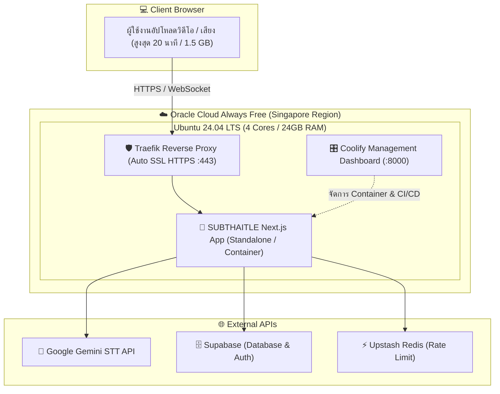

# ☁️ คู่มือการย้ายระบบ SUBTHAITLE ไปยัง Oracle Cloud (Always Free) + Coolify

คู่มือสรุปขั้นตอนการย้ายระบบจาก **Vercel** ไปยัง **Oracle Cloud Infrastructure (Always Free)** โดยใช้งานร่วมกับ **Coolify (Self-hosted PaaS)** เพื่อปลดล็อกข้อจำกัดของ Serverless (Timeout 10–60 วินาที, Payload 4.5 MB) รองรับการถอดเสียงคลิปยาว **15–30+ นาที** ได้อย่างเสถียร โดยมีค่าใช้จ่ายเซิร์ฟเวอร์เป็น **฿0 ตลอดชีพ**

---

## 🎯 ทำไมต้อง Oracle Cloud Always Free + Coolify?

| คุณสมบัติ | Vercel (Hobby Free) | Oracle Cloud Always Free + Coolify |
| :--- | :--- | :--- |
| **ค่าบริการเซิร์ฟเวอร์** | ฟรี (จำกัดโควตา) | **ฟรีตลอดชีพ ฿0** |
| **สเปกเครื่อง** | Serverless ชั่วคราว | **4 OCPU (ARM), 24 GB RAM, 200 GB Storage** |
| **Timeout ขีดจำกัดเวลา** | 10 – 60 วินาที (ตัดการทำงาน) | **ไม่จำกัด (รันงานข้ามชั่วโมงได้)** |
| **ขนาดไฟล์อัปโหลด** | ไม่เกิน 4.5 MB | **ไม่จำกัด (ขึ้นกับขนาดดิสก์ 200GB)** |
| **สถานะเซิร์ฟเวอร์** | ปิดตัวเมื่อไม่มีคนเข้า | **Always-On รัน 24/7 ไม่มี Sleep/Cold Start** |
| **ความสะดวกในการ Deploy** | เชื่อมต่อ GitHub กด Deploy | **หน้า Dashboard เหมือน Vercel เชื่อมต่อ GitHub Auto-deploy ได้เหมือนกัน** |

---

## 🗺️ แผนผังภาพรวมระบบ (Architecture)



---

## 📋 5 ขั้นตอนการติดตั้งและย้ายระบบ (Step-by-Step)

### สเต็ปที่ 1: สมัครบัญชี Oracle Cloud Always Free

1. เข้าเว็บไซต์: [https://www.oracle.com/cloud/free/](https://www.oracle.com/cloud/free/)
2. คลิก **Start for free** และกรอกข้อมูล:
   - **Country:** Thailand
   - **Home Region (สำคัญมาก):** เลือก **`Singapore (AP-SINGAPORE-1)`** เพราะเป็น Data Center ที่ใกล้ไทยที่สุด ค่า Latency ต่ำเพียง ~20–30ms
3. **Payment Verification:**
   - กรอกข้อมูลบัตรเครดิต (เช่น KBank)
   - ระบบจะทดลองกันวงเงิน ~$1 (ประมาณ 35 บาท) เพื่อยืนยันตัวตน และจะคืนเงินทันที
   - *หมายเหตุ: Oracle จะไม่ตัดเงินใด ๆ หากเราเลือกใช้เฉพาะทรัพยากรที่มีป้าย "Always Free Eligible"*

---

### สเต็ปที่ 2: สร้างเครื่องเซิร์ฟเวอร์ (Compute Instance)

1. เข้าสู่ **Oracle Cloud Console**
2. ไปที่เมนูซ้ายบน `☰` > **Compute** > **Instances** > คลิกปุ่ม **Create Instance**
3. ตั้งค่าข้อมูลเครื่องดังนี้:
   - **Name:** `subthaitle-vm`
   - **Placement:** เลือก Availability Domain ที่มีโควตา (ปกติ AD-1 หรือ AD-2)
   - **Image and shape:**
     - คลิก **Change Image** > เลือก **Ubuntu 24.04 LTS** (หรือ 22.04)
     - คลิก **Change Shape** > เลือก **Ampere (ARM Processor)** > ติ๊กเลือก `VM.Standard.A1.Flex`
     - กำหนดสเปก: **4 OCPU** และ **24 GB Memory** (ใช้สิทธิ์ Always Free ได้เต็มที่)
   - **Networking:**
     - เลือก **Create new virtual cloud network** (VCN)
     - เลือก **Assign a public IPv4 address: Yes**
   - **Add SSH keys (สำคัญ):**
     - เลือก **Generate a key pair for me**
     - คลิกปุ่ม **Save private key** ดาวน์โหลดไฟล์ `.key` เก็บไว้ใน Mac อย่างปลอดภัย (เช่นโฟลเดอร์ `~/.ssh/oracle_key.key`)
4. คลิกปุ่ม **Create** ด้านล่างสุด แล้วรอประมาณ 1–2 นาทีจนสถานะเครื่องเป็น **Running (สีเขียว)**
5. บันทึก **Public IP Address** ของเครื่องไว้ (เช่น `129.150.x.x`)

---

### สเต็ปที่ 3: เปิดพอร์ตเครือข่าย (Security List / Firewall)

เพื่อให้คนภายนอกเข้าถึงเว็บและหน้า Coolify ได้ ต้องเปิดพอร์ตบน Oracle Cloud:

1. ในหน้า Instance คลิกที่ชื่อเครือข่ายในหัวข้อ **Primary VNIC** > คลิกที่ **Subnet**
2. คลิกที่ **Default Security List for...**
3. คลิกปุ่ม **Add Ingress Rules** และเพิ่ม 3 กฎดังนี้:
   - **กฎที่ 1 (HTTP/HTTPS สำหรับเว็บไซต์):**
     - Source CIDR: `0.0.0.0/0`
     - Destination Port Range: `80,443`
     - Description: `Web Traffic HTTP/HTTPS`
   - **กฎที่ 2 (Dashboard ของ Coolify):**
     - Source CIDR: `0.0.0.0/0`
     - Destination Port Range: `8000`
     - Description: `Coolify Management Dashboard`
4. คลิก **Add Ingress Rules**

---

### สเต็ปที่ 4: เชื่อมต่อ SSH และติดตั้ง Coolify

1. เปิดแอป **Terminal** บนเครื่อง Mac
2. เปลี่ยนสิทธิ์ไฟล์ Key ที่ดาวน์โหลดมา:
   ```bash
   chmod 400 ~/.ssh/oracle_key.key
   ```
3. เชื่อมต่อเข้าไปยังเครื่องเซิร์ฟเวอร์:
   ```bash
   ssh -i ~/.ssh/oracle_key.key ubuntu@<YOUR_ORACLE_PUBLIC_IP>
   ```
4. **เปิด Firewall ภายในระบบ Ubuntu (IPTables):**
   ```bash
   sudo iptables -I INPUT 6 -m state --state NEW -p tcp --dport 80 -j ACCEPT
   sudo iptables -I INPUT 6 -m state --state NEW -p tcp --dport 443 -j ACCEPT
   sudo iptables -I INPUT 6 -m state --state NEW -p tcp --dport 8000 -j ACCEPT
   sudo netfilter-persistent save
   ```
5. **รันคำสั่งติดตั้ง Coolify บรรทัดเดียว:**
   ```bash
   curl -fsSL https://cdn.coollabs.io/coolify/install.sh | bash
   ```
   *(รอระบบดาวน์โหลด Docker และตั้งค่าระบบประมาณ 3–5 นาที)*
6. เมื่อติดตั้งเสร็จ เปิดเบราว์เซอร์แล้วเข้า URL:
   `http://<YOUR_ORACLE_PUBLIC_IP>:8000`
7. สร้างบัญชีผู้ดูแลระบบ (Admin Email & Password) หน้าแรกของ Coolify

---

### สเต็ปที่ 5: เชื่อมต่อ GitHub และ Deploy เว็บไซต์

1. บน Coolify Dashboard:
   - ไปที่เมนู **Sources** > **Add GitHub App** (หรือต่อผ่าน Personal Access Token) เพื่ออนุญาตให้เข้าถึง Repo `wisitan/SUBTHAITLE`
2. ไปที่หน้า **Projects** > คลิก **Create New Project**
3. เลือก **Add Environment** > คลิก **+ New Resource** > เลือก **Public/Private Repository**
4. เลือกคลังโค้ด: `wisitan/SUBTHAITLE`
5. ตั้งค่าการ Build:
   - **Branch:** `main` (หรือ `uat` สำหรับเครื่องทดสอบ)
   - **Build Pack:** เลือก `Nixpacks` (ตรวจจับ Next.js อัตโนมัติและคอมไพล์ได้เร็วมาก)
   - **Ports Exposes:** `3000`
6. ใส่ตัวแปรแวดล้อม (**Environment Variables**):
   - คัดลอกค่าทั้งหมดจาก `.env.local` หรือจากหน้า Vercel Environment Variables มาวาง เช่น:
     ```env
     GEMINI_API_KEY=...
     GEMINI_PAID_API_KEY=...
     NEXT_PUBLIC_SUPABASE_URL=...
     NEXT_PUBLIC_SUPABASE_ANON_KEY=...
     SUPABASE_SERVICE_ROLE_KEY=...
     UPSTASH_REDIS_REST_URL=...
     UPSTASH_REDIS_REST_TOKEN=...
     STRIPE_SECRET_KEY=...
     STRIPE_WEBHOOK_SECRET=...
     ```
7. ตั้งค่าโดเมนและ SSL:
   - ในช่อง **Domains**: ใส่โดเมนที่ต้องการ เช่น `https://subthaitle.yourdomain.com` (โดยไปตั้งค่า DNS ชี้ A Record มาที่ Oracle Public IP)
   - Coolify จะดึงใบรับรองความปลอดภัย **Let's Encrypt SSL (HTTPS)** ให้อัตโนมัติฟรี
8. คลิกปุ่ม **Deploy** ด้านขวาบน
   - รอระบบ Build ครั้งแรกประมาณ 2–3 นาที เว็บไซต์จะออนไลน์ทันที
   - หลังจากนี้ ทุกครั้งที่มีการ `git push origin main` ตัว Coolify จะดึงโค้ดและ Re-deploy ให้อัตโนมัติเหมือน Vercel ทุกประการ!

---

## ⚙️ การปรับแต่งฝั่งโค้ดเพื่อให้รองรับคลิปยาวได้อย่างสมบูรณ์

เมื่อย้ายมาอยู่บนเซิร์ฟเวอร์ของตัวเองแล้ว สามารถปรับแต่งค่าคอนฟิกให้พร้อมรับไฟล์เสียงขนาดใหญ่ขึ้นได้:

1. **ปลดล็อก Request Body Limit ใน Next.js:**
   ใน `src/app/api/transcribe/route.ts` ไม่ถูกจำกัดขนาด 4.5 MB ของ Vercel อีกต่อไป สามารถรับไฟล์ขนาด 20–50 MB ได้ทันที
2. **ไม่ต้องกังวลเรื่อง Execution Timeout:**
   ฟังก์ชันใน Node.js สามารถรันยาวต่อเนื่อง 2–5 นาทีได้โดยไม่ถูกตัดสาย ทำให้ AI ถอดเสียงคลิปสูงสุด 20 นาทีและส่งผลลัพธ์กลับมาครบถ้วน

---

## 🔒 ข้อแนะนำด้านความปลอดภัยและการประหยัดค่าใช้จ่าย

1. **ตรวจสอบป้าย Always Free:**
   ในหน้า Oracle Console ทุกครั้งที่สร้าง Resource ให้สังเกตป้ายสีเทาอ่อนระบุว่า `Always Free Eligible` เสมอ
2. **การสำรองข้อมูล (Backup):**
   Coolify มีฟังก์ชันสำรองข้อมูลการตั้งค่าเข้า Google Drive, S3, หรือเครื่อง Local ได้ในคลิกเดียว
3. **การทดสอบความเสถียร:**
   ช่วงเริ่มต้น แนะนำให้เปิดรันคู่ขนานกับ Vercel ก่อน โดยให้ Vercel รัน Branch `main` และให้ Oracle Cloud รัน Branch `uat` เพื่อทดสอบประสิทธิภาพกับคลิปยาวจนมั่นใจ 100% จึงค่อยสลับโดเมนหลักมาที่ Oracle ค่ะ
